<h1 align="center">TeVim</h1>

<h4 align="center">Neovim config by SownteeNguyen @sownteedev</h2>

<div align="center">
 
[](https://github.com/neovim/neovim)


[](https://github.com/sownteedev/TeVim)
<a href="https://discordapp.com/users/745732774027198554"></a>
</div>

## 📷 Showcase

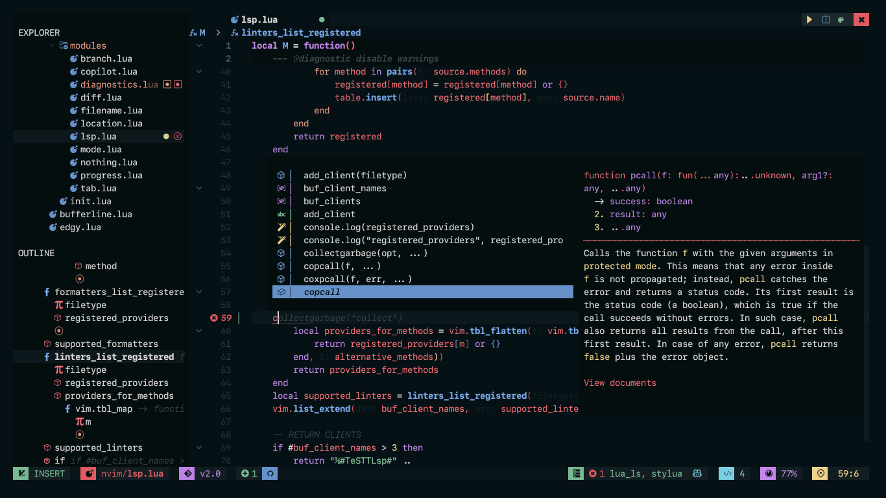

<div align="center">

```txt
Performance for time startup
On Power                              : 0.020s - 0.036s
On Battery                            : 0.024s - 0.041s
```

</div>
<h5> Themes Showcase with 16 colorschemes </h5>

|    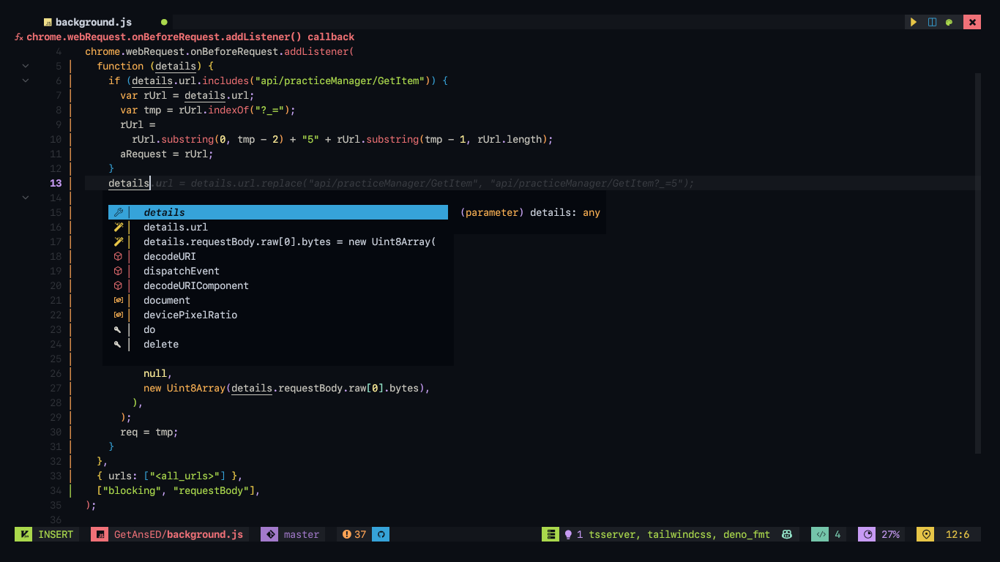    |  |   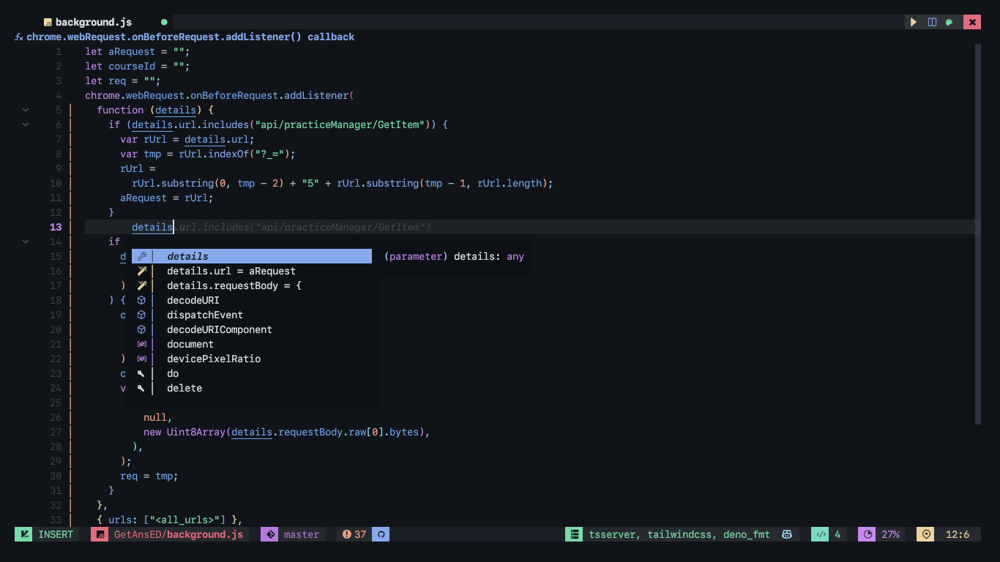    | 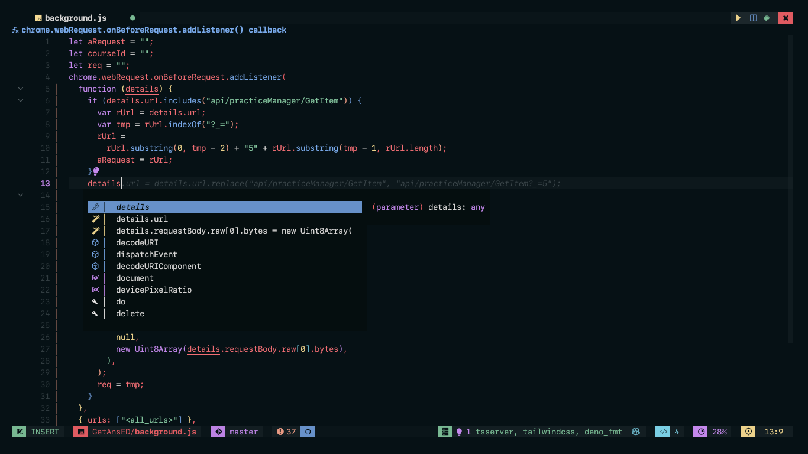    |
| :---------------------------------------------------------------: | :----------------------------------------------------------------: | :----------------------------------------------------------------: | -------------------------------------------------------------------- |
| 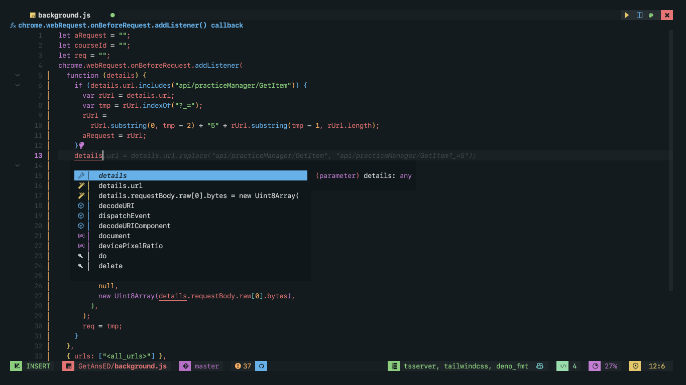 |  |  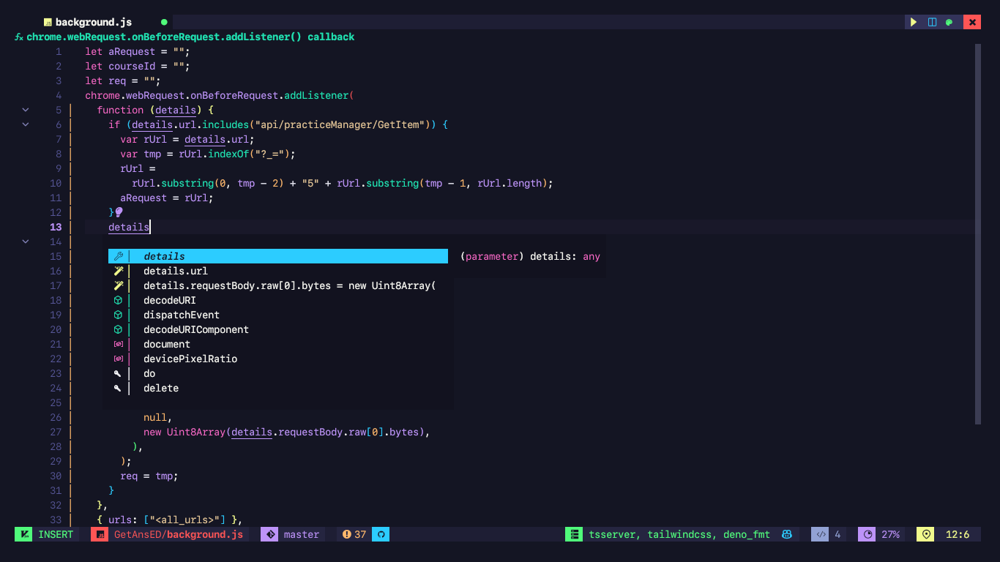   | 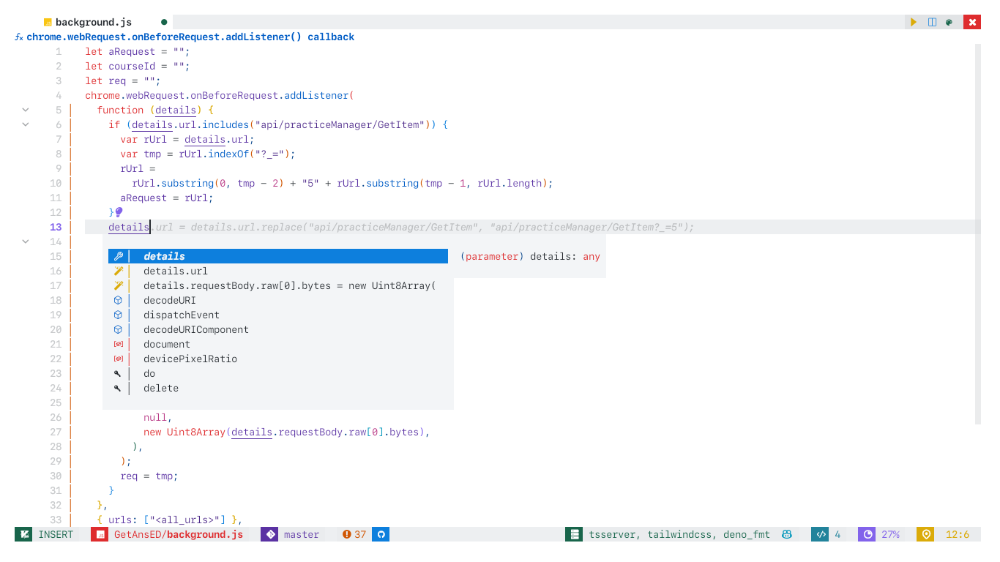 |
|  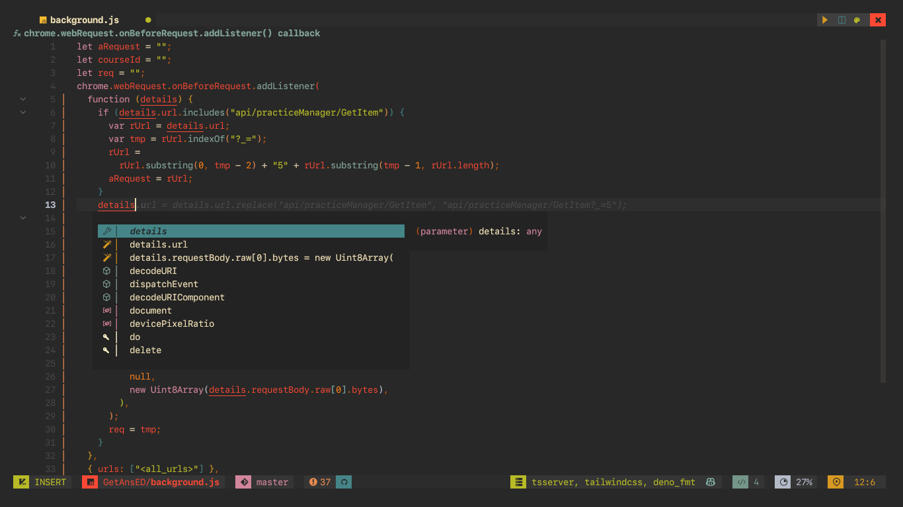  |  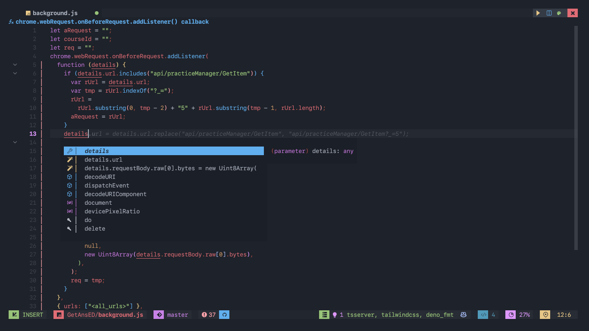   |   | 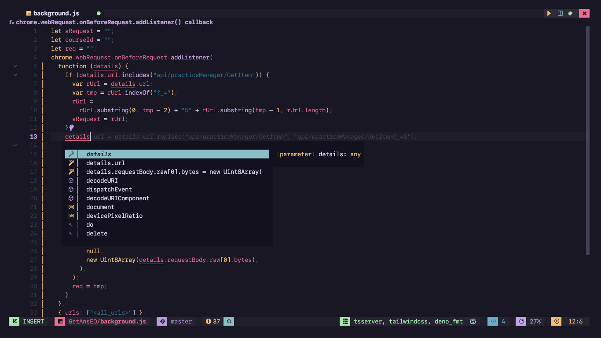     |
|  |   | 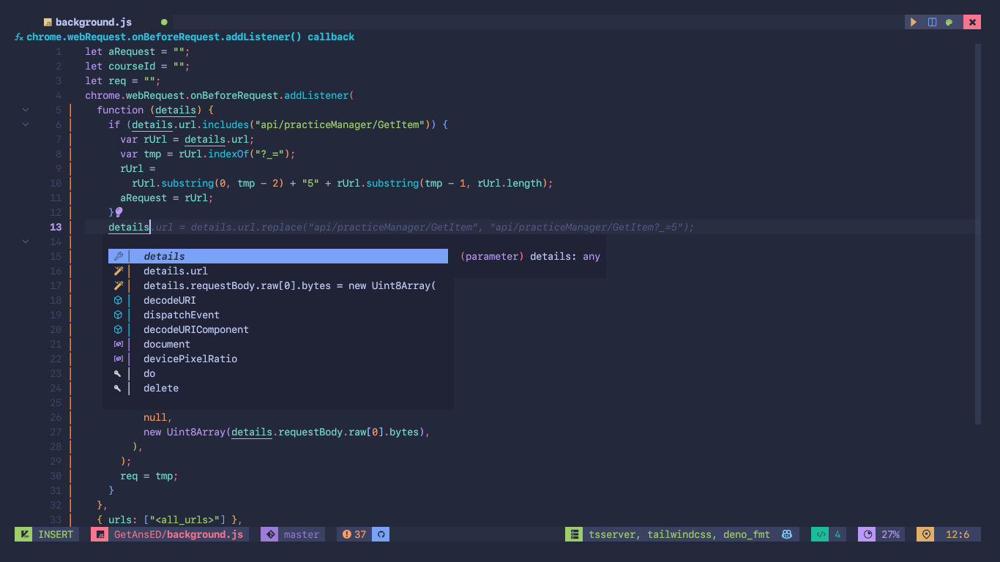 |          |

</details>

<h6>Updating...</h6>

## Plugins And Features

| Plugin                                                                                | Description                                                    |  Lazy   |
| ------------------------------------------------------------------------------------- | -------------------------------------------------------------- | :-----: |
| [folke/lazy](https://github.com/folke/lazy.nvim)                                      | the package manager for newbies                                | `false` |
| [nvim-treesitter/nvim-treesitter](https://github.com/nvim-treesitter/nvim-treesitter) | syntax highlighting, most popular one for neovim               | `true`  |
| [NvChad/nvim-colorizer.lua](https://github.com/NvChad/nvim-colorizer.lua)             | highlights colors and is really frickin fast                   | `true`  |
| [nvim-neo-tree/neo-tree.lua](https://github.com/nvim-neo-tree/neo-tree.nvim)          | a very neat, simple and clean file tree and most features      | `true`  |
| [nvim-tree/nvim-web-devicons](https://github.com/nvim-tree/nvim-web-devicons)         | more devicons for neovim                                       | `true`  |
| [folke/which-key.nvim](https://github.com/folke/which-key.nvim)                       | shows all the posiible vim keybindings, perfect for dummies    | `true`  |
| [nvim-telescope/telescope.nvim](https://github.com/nvim-telescope/telescope.nvim)     | probably the most popular menu. can be used for a lot of stuff | `true`  |
| [akinsho/toggleterm.nvim](https://github.com/akinsho/toggleterm.nvim)                 | terminal integration in neovim                                 | `true`  |
| [lewis6991/gitsigns.nvim](https://github.com/lewis6991/gitsigns.nvim)                 | Super fast git decorations implemented purely in Lua.          | `true`  |
| [williamboman/mason.nvim](https://github.com/williamboman/mason.nvim)                 | installing LSPs made super easy                                | `true`  |
| [nvimdev/lspsaga.nvim](https://github.com/nvimdev/lspsaga.nvim)                       | responsible for the winbar and lightbulb                       | `true`  |
| [kevinhwang91/nvim-ufo](https://github.com/kevinhwang91/nvim-ufo)                     | folds in neovim arent that bad! actually, better than vscode   | `true`  |
| [L3MON4D3/LuaSnip](https://github.com/L3MON4D3/LuaSnip)                               | very simple and easy to use snippet engine                     | `true`  |
| [simrat39/symbols-outline.nvim](https://github.com/simrat39/symbols-outline.nvim)     | a tree like view for symbols via lsp                           | `true`  |
| [numToStr/Comment.nvim](https://github.com/numToStr/Comment.nvim)                     | quik and easy commenting                                       | `true`  |
| [folke/todo-comments.nvim](https://github.com/folke/todo-comments.nvim)               | beautiful highlights for TODO comments                         | `true`  |
| [folke/trouble.nvim](https://github.com/folke/trouble.nvim)                           | pretty list for showing diagnostics, references, etc           | `true`  |

and more plugins...
<br>

<h2>🔎 Requirement </h2>
- Make you sure, you're using NeoVim Nightly

- Install all libaries support (optional)
  ```
  sudo pacman -S nodejs npm yarn python python-pip clang jdk-openjdk rustup
  ```
- If you on X11 install xsel and xclip to copy and paste
  ```
  sudo pacman -S xsel xclip
  ```
- Next we need to install python support (Node is optional)
  - Neovim python support
  ```
    pip install pynvim
  ```
  - Neovim Node support
  ```
    npm i -g neovim
  ```
- Other dependencies for formatting & finding text :
  - Prettier
  ```
   npm i -g prettier
  ```
  - Ripgrep Fzf Lazygit
  ```
   sudo pacman -S ripgrep fzf lazygit
  ```

<h2> ⬇️  Installation </h2>

- Backup old config
  ```
  mv ~/.config/nvim ~/.config/nvim.bak
  ```
- Remove old plugins and setup
  ```
  rm -rf ~/.local/share/nvim ~/.local/state/nvim ~/.cache/nvim ~/.config/nvim/lazy-lock.json
  ```
- Install TeVim
  ```
  git clone https://github.com/sownteedev/TeVim ~/.config/nvim --depth 1 && nvim
  ```
- Wait for everything to install, reopen Neovim
- Use command ":TSInstall all" and ":MasonInstallAll"

ENJOY !

<details><summary> <b><i>Credits</b></i></summary>

- [Nvchad](https://github.com/nvchad/base46) helped me with NeoVim themes

</details>
