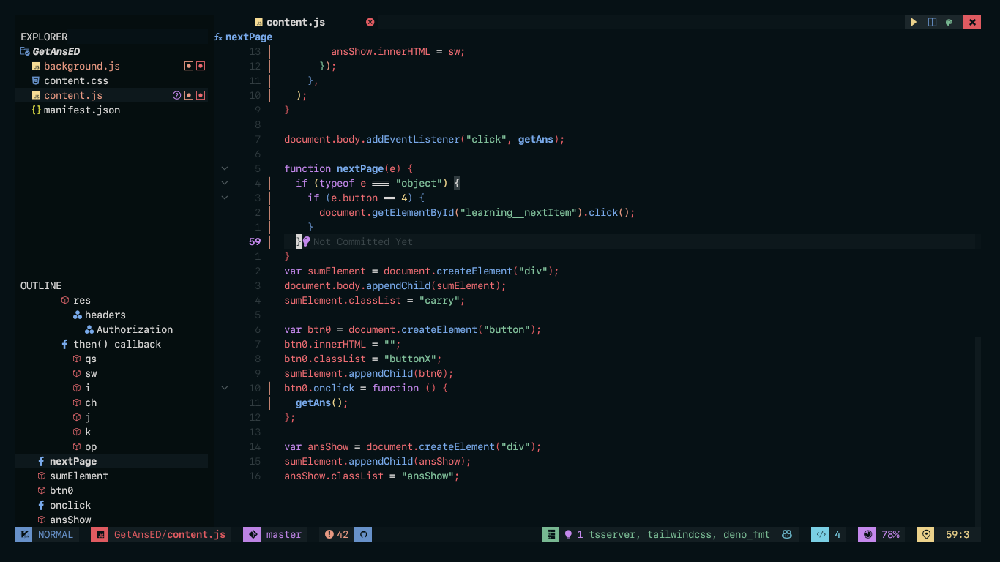
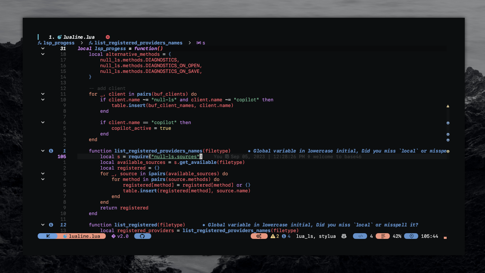
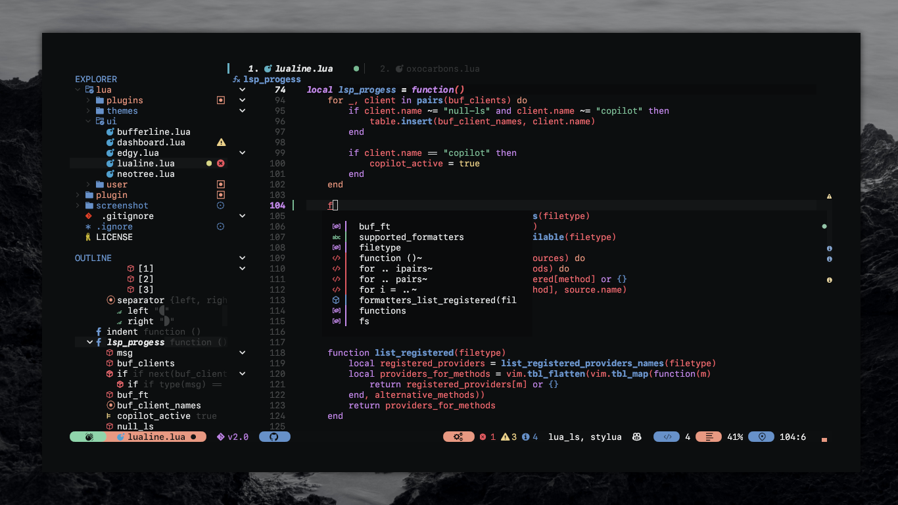
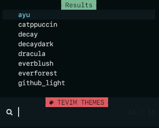
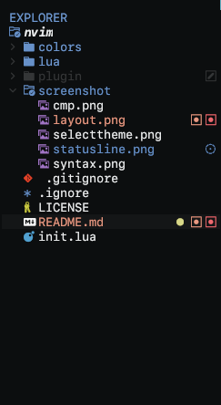
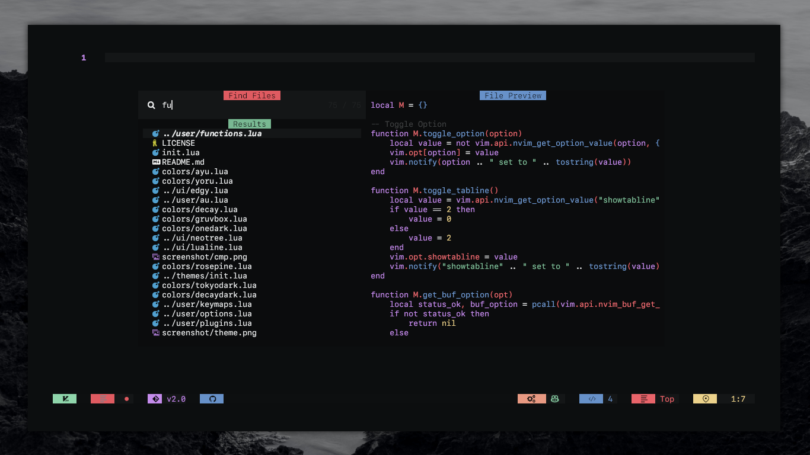

<h1 align="center">TeVim</h1>

<h4 align="center">Neovim config by SownteeNguyen @sownteedev</h2>

## Showcase

## UI related plugins used

 <b>Images</b>

<h4> Neotree.lua </h3>

<kbd></kbd>

<h4> Telescope-nvim </h3>

A fuzzy file finder, picker, sorter, previewer and much more:

<kbd></kbd>

<h4> Statusline with Lualine.nvim </h3>

<kbd></kbd>

<h4> Show bindkeys with Whichkey </h3>

<kbd></kbd>

## Plugins list

- Mange plugins with [packer.nvim](https://github.com/wbthomason/packer.nvim)
- Many beautiful themes, theme toggle from [nvchad/base46](https://github.com/NvChad/base46)
- Buffer and Statusline with [bufferline.nvim](https://github.com/akinsho/bufferline.nvim) & [lualine.nvim](https://github.com/nvim-lualine/lualine.nvim)
- File navigation with [neo-tree.nvim](https://github.com/nvim-neo-tree/neo-tree.nvim)
- Beautiful and configurable icons with [nvim-web-devicons](https://github.com/kyazdani42/nvim-web-devicons)
- Git diffs and more with [gitsigns.nvim](https://github.com/lewis6991/gitsigns.nvim)
- NeoVim Lsp configuration with [nvim-lspconfig](https://github.com/neovim/nvim-lspconfig) and [mason.nvim](https://github.com/williamboman/mason.nvim)
- Autocompletion with [nvim-cmp](https://github.com/hrsh7th/nvim-cmp)
- File searching, previewing image and text files and more with [telescope.nvim](https://github.com/nvim-telescope/telescope.nvim).
- Syntax highlighting with [nvim-treesitter](https://github.com/nvim-treesitter/nvim-treesitter)
- Autoclosing braces and html tags with [nvim-autopairs](https://github.com/windwp/nvim-autopairs)
- Useful snippets with [friendly snippets](https://github.com/rafamadriz/friendly-snippets) + [LuaSnip](https://github.com/L3MON4D3/LuaSnip).
- Popup mappings keysheet [whichkey.nvim](https://github.com/folke/which-key.nvim)
- Terminal with [toggleterm.nvim](https://github.com/akinsho/toggleterm.nvim)

and more plugins...

 <b><i>Credits</b></i>

- [Nvchad](https://github.com/nvchad/base46) helped me with NeoVim themes

