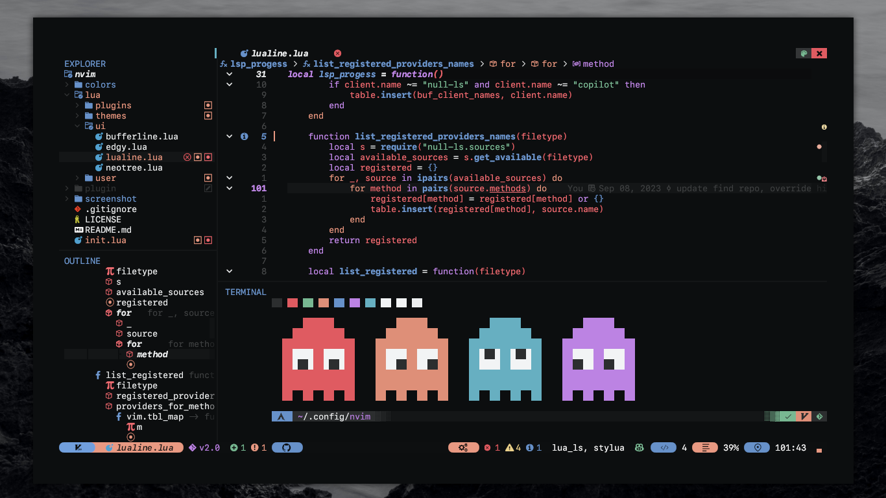
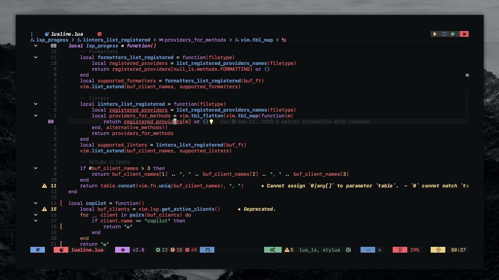
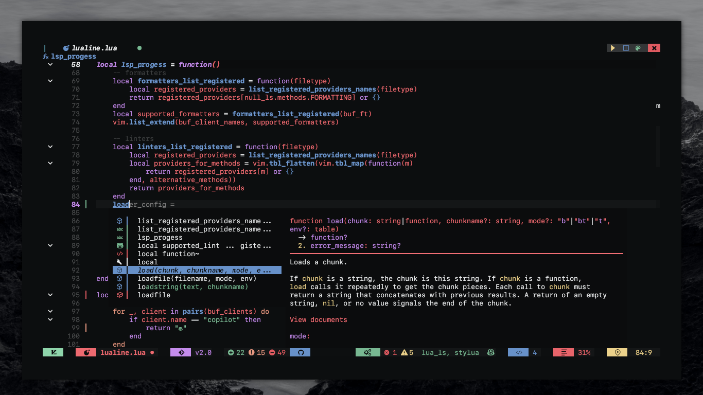
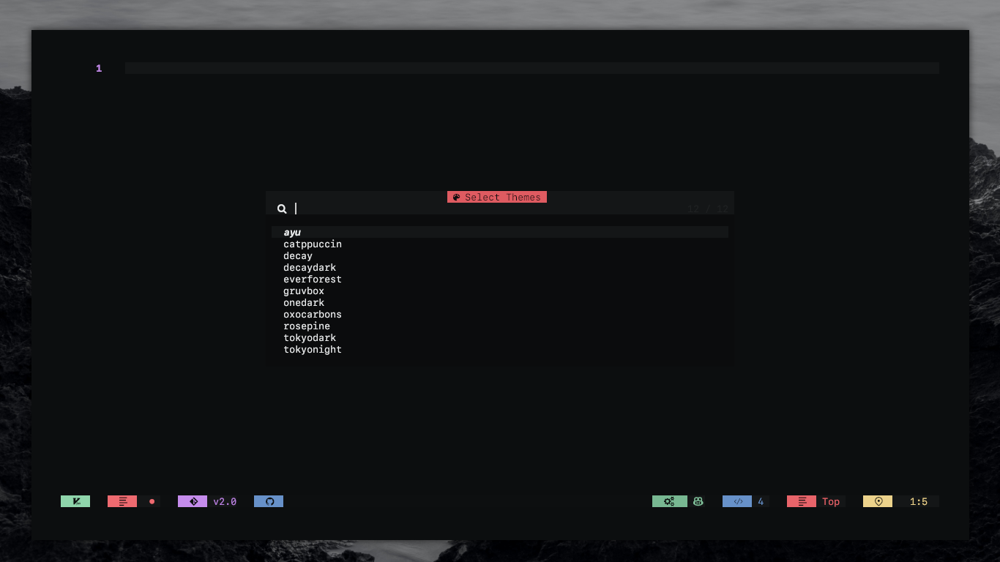
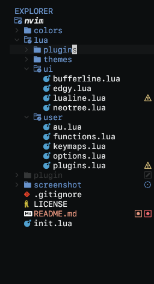
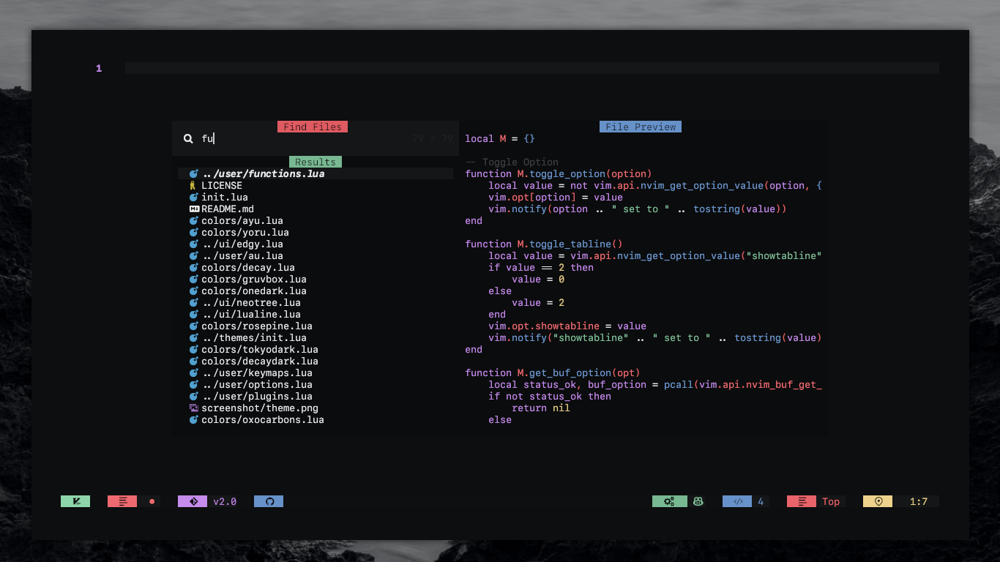

<h1 align="center">TeVim</h1>

<h4 align="center">Neovim config by SownteeNguyen @sownteedev</h2>

<div align="center">
 
[](https://github.com/neovim/neovim)


[](https://github.com/sownteedev/TeVim)
<a href="https://discordapp.com/users/745732774027198554"></a>
</div>
  
## 📷 Showcase






## 🔌 UI related plugins used

<details><summary> <b>Images</b></summary>

<h4> Expoler </h3>



<h4> Find </h3>



<h4> Buffer with toggle theme, quit and run</h4>


<h4> Statusline auto find copilot, git repo</h3>


<h4> Show bindkeys with Whichkey </h3>


</details>

## ⚙️ Plugins

- Mange plugins with [packer.nvim](https://github.com/wbthomason/packer.nvim)
- Many beautiful themes, theme toggle from [nvchad/base46](https://github.com/NvChad/base46)
- Buffer and Statusline with [bufferline.nvim](https://github.com/akinsho/bufferline.nvim) & [lualine.nvim](https://github.com/nvim-lualine/lualine.nvim)
- File navigation with [neo-tree.nvim](https://github.com/nvim-neo-tree/neo-tree.nvim)
- Beautiful and configurable icons with [nvim-web-devicons](https://github.com/kyazdani42/nvim-web-devicons)
- Git diffs and more with [gitsigns.nvim](https://github.com/lewis6991/gitsigns.nvim)
- NeoVim Lsp configuration with [nvim-lspconfig](https://github.com/neovim/nvim-lspconfig) and [mason.nvim](https://github.com/williamboman/mason.nvim)
- Autocompletion with [nvim-cmp](https://github.com/hrsh7th/nvim-cmp)
- File searching, previewing image and text files and more with [telescope.nvim](https://github.com/nvim-telescope/telescope.nvim).
- Syntax highlighting with [nvim-treesitter](https://github.com/nvim-treesitter/nvim-treesitter)
- Autoclosing braces and html tags with [nvim-autopairs](https://github.com/windwp/nvim-autopairs)
- Useful snippets with [friendly snippets](https://github.com/rafamadriz/friendly-snippets) + [LuaSnip](https://github.com/L3MON4D3/LuaSnip).
- Popup mappings keysheet [whichkey.nvim](https://github.com/folke/which-key.nvim)
- Terminal with [toggleterm.nvim](https://github.com/akinsho/toggleterm.nvim)

and more plugins...

<br>
<h2>🔎 Requirement</h2>
- You probably notice you don't have support for copy and paste also that python and node haven't been setup
  
  - If you on X11 install xsel and xclip
    
    ```
    sudo pacman -S xsel xclip
    ```

- Next we need to install python support (Node is optional)
  - Neovim python support:
  ```
    pip install pynvim
  ```
  - Neovim Node support
  ```
    npm i -g neovim
  ```
- Other dependencies for formatting & finding text :

  - Prettier

  ```bash
    npm i -g prettier
  ```

  - Ripgrep Fzf Lazygit

  ```
    sudo pacman -S ripgrep fzf lazygit
  ```

<details><summary> <b><i>Credits</b></i></summary>

- [Nvchad](https://github.com/nvchad/base46) helped me with NeoVim themes

</details>
